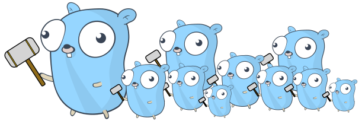
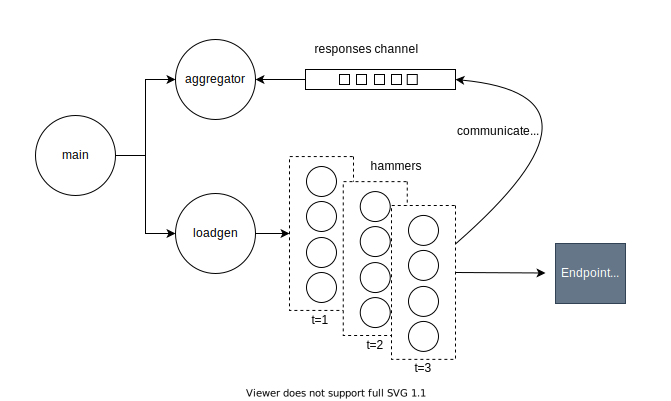
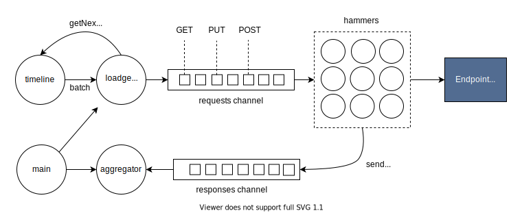

# go-hammer




A load generator written in Go.
<br><br>

## Usage

### Command Line Tool

```bash
cli run --endpoint https://aws.amazon.com --duration 60 --tps 1
```

### Library

```go
import (
	"github.com/ferdingler/go-hammer/core"
	"github.com/ferdingler/go-hammer/hammers"
)

func main() {
	config := core.RunConfig{
		TPS:      10,
		Duration: 60,
	}

	hammer := new(hammers.HTTPHammer)
	hammer.Endpoint = "https://www.google.com"
	hammer.Method = "GET"
	hammer.Headers = map[string]string{
		"content-type": "application/json",
	}

	core.Run(config, hammer)
}
```

## Custom hammers

This library will have a number of built-in generic hammers that users can leverage to get started very quickly, like the HTTPHammer. But the real power and extensibility of the library comes by writting custom _hammers_ that implement the Hammer interface and have custom logic that runs on every request.

```go
type Hammer interface {
	Hit() HammerResponse
}
```

This library can also evolve to provide useful tools to the _hammers_ to make their implementation easier, for example, a random data generator or a user credentials provider. 

<hr>

## TPS Generator

The _loadgen_ goroutine creates as many goroutines as TPS specified every second. These goroutines are the _hammers_ that generate a request targeting the endpoint under test. They capture the response of the request, measure the roundtrip latency and communicate the results back to a shared _responses_ channel–– they die right after that. There is an _aggregator_ goroutine reading the responses from the shared channel, writing them to standard output and keeping them in-memory to compute a final summary with latency statistics. The _main_ goroutine serves as an orchestrator and tells the _aggregator_ to stop and summarize results when it receives a signal of completion from _loadgen_. 



Decoupling the _hammers_ implementation from the TPS generation and orchestration gives a lot of opportunity for extensibility. There can be hammers of different types, for example, a hammer of type _HTTPHammer_ knows how to trigger HTTP requests, but a hammer of type _IoTHammer_ knows how to generate MQTT requests. Moreover, the _Hammer_ interface allows any user to write their own hammer implementation as long as it complies with the interface. 

**Will it be a problem to have so many goroutines running at once?**  
Goroutines are very lightweight and efficient as they do not map directly to OS threads. In the tests that I have done, only a handful of threads are used for ~100 goroutines in-flight, so having thousands or goroutines should not be a problem at all. 

**Can the aggregator become a bottleneck?**  
Possibly above 10K TPS. When the hammers write to the _responses_ channel they block until the _aggregator_ reads; This is the nature of how channels work because they are also a synchronization mechanism. In my benchmark, the _aggregator_ takes on average 0.05ms to process a response from the channel, which means that it can flush 10,000 messages in 500ms. So, as long as the _aggregator_ can drain the entire channel in less than 1 second, then it won't become a bottleneck.

### Alternatives considered

**Long living goroutines**  
Instead of creating short-lived single goroutines (hammers) per request, I considered creating as many goroutines as TPS specified and have each goroutine be long-living for the duration of the load test (i.e. 30 minutes). Each of these workers would be in charge of generating a request every second. The challenge is that if a given request takes longer than 1 second to complete, the system will not meet the desired TPS. This is not a good approach. 

## Run tests

Functional testing is done by spinning up a local web server and then pointing the load generator against it. The local web server verifies that the expected number of requests generated are actually received.

```
go test -v
```

## Profiling

```
go test -cpuprofile cpu.prof -memprofile mem.prof -bench .
go tool pprof cpu.prof
```

## Limits

The max TPS is usually constrained by the host OS max open files limit. The package net/http opens a socket for every HTTP request in-flight. To find this limit in Unix use the following command:

```
ulimit -n
```

Increase this limit by passing the desired number:

```
ulimit -n 1000
```

## Ideas to work on

**Distribute requests evenly within the timeframe of a second**  
The current implementation triggers all requests in the beginning of a second, obviously each consecutive request is triggered slightly (a few microseconds) after the previous one, but this means that all the remaining time before the second is over is empty and quiet with no requests. The idea would be to distribute all of these requests evenly within the timeframe of a second to mimic real-world traffic patterns more realistically and therefore avoid spikes of pressure on the system under test.

**Replay production load**  
Given a set of access logs captured from real production traffic, add a capability to this library to create a test scenario that replays and reproduces the exact same traffic taken from the logs. There needs to be a process that reads the logs first and builds a timeline to be executed during the load generation. A challenge here is that access logs do not contain body payloads, only headers. 

The following diagram illustrates the architecture for replaying a timeline of logs. Each goroutine involved is represented as a circle. The timeline goroutine holds an in-memory representation of the timeline of how requests happened, it should expose an API to get the next batch of requests for the following second, it could return zero if there are no requests to be made in that given second. 



Building the timeline itself from a set of logs is not represented in the diagram. That's probably the job of another tool that given a set of logs in a particular format, it builds a timeline that go-hammer can understand. 